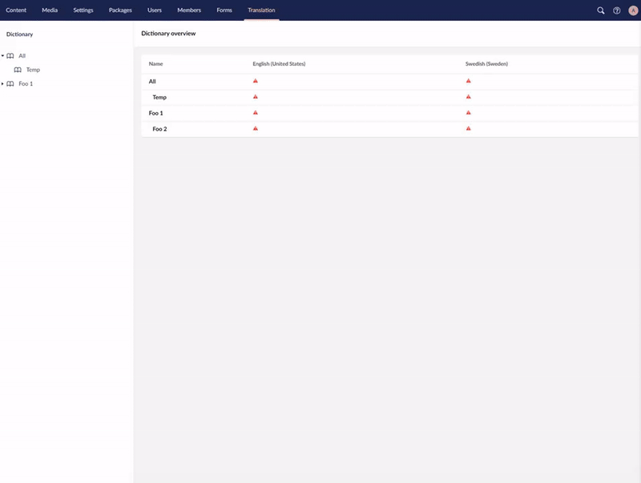

# Move dictionaries

Hindsight is 20/20 move existing dictionaries instead of recreating them! Move dictionaries is a package for umbraco v8 that allows you to move dictionaries.

[](https://www.nuget.org/packages/MoveDictionaries)



## Installation

You can install MoveDictionaries via Nuget

```
PM> Install-Package MoveDictionaries
```

Or via Umbraco backoffice!

## Contributing

If you would like to help me improve this package, feel free to create a pull request!

## Issues

If you find any issues with the package feel free to raise a issue!
